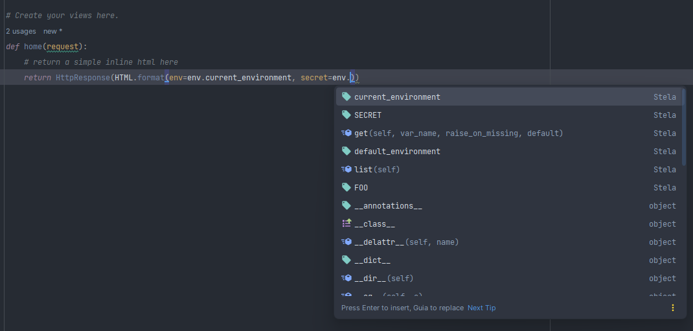

# Autocomplete data on IDEs

The best way to work with Environment Variables is using the autocomplete (or IntelliSense) feature from your IDE. To
make this work with dotenv-read data, Stela updates its type stub file (`stela/__init__.pyi`) every time the configuration is (re)loaded.



This stub file needs to be saved on the same folder which you've installed the `stela` package (normally via package manager). In
other words, in a folder outside your project. To this work, please make sure the user which starts your project has
sufficient privileges to access these external folders.

!!! tip "It works for dynamic variables too"
    The same is true for values retrieved from other sources than dotenv files (see next section ["The Stela Loader"](the_final_loader.md)
    ). The stub file is always updated after Stela process the loader.

### Troubleshooting stub creation

You can enable Stela logs (`show_logs`) to see the messages regarding stub creation.

=== ".stela"
    ```ini
    [stela]
    show_logs = true
    ```

=== "pyproject.toml"
    ```toml
    [tool.stela]
    show_logs = true
    ```

=== "shell"
    ```bash
    $ export STELA_SHOW_LOGS=true
    ```

If you want to manually update the stub file, please use the command `stela gen-stub`.

Note: dynamic attributes in the stub are typed as `Any`. This avoids
misleading static types because values may be parsed to different Python
types at runtime (int, float, bool, dict, list, etc.). IDE plugins are not
required — the `.pyi` is the standard and portable way for editors and
static analyzers to know the available attributes on `env`.

```bash
$ stela gen-stub
```

??? question "If I cannot generate the stub?"
    Stela stills works normally, but IDE can't autocomplete the `env` object with the data received.

---

For the next step, we will look at Stela default loader and how to use another source than dotenv files.
